[Home](readme.md) |
[Reverse engineering](re.md) |
BTMD v0.1 -
[v0.2](v0.2.md) -
[v0.3](v0.3.md) |
[References](refs.md)

## BTMD v0.1

The first attempt at building a Bluetooth-enabled Minidisc player.

:information_source:
This version is obsolete. I recommend looking at [v0.2](v0.2.md) and beyond if you are attempting to build your own BTMD player. However, v0.2 references a lot of the information on this page, so reading is recommended nevertheless.

### Requirements

- Inspection of the [reference materials](refs.md)
- Electronics and soldering skills
- Good equipment for soldering and troubleshooting (multimeter, oscilloscope, etc.)
- Patience and perseverance

:warning:
This is not a beginner project. Even though this document may read like step-by-step instructions, not every detail is covered, and some intuition and skill is required.

### Materials

- Sony MZ-R500 Minidisc player ([minidisc.org](https://www.minidisc.org/part_Sony_MZ-R500.html), [MiniDisc wiki](https://www.minidisc.wiki/equipment/sony/portable/mz-r500))
- [Scosche FlyTunes](https://www.scosche.com/wireless-bluetooth-audio-transmitter) Bluetooth transmitter
- [Pololu S7V8F3](https://www.pololu.com/product/2122) step-up/step-down voltage regulator module
- 1x resistor, 0805, 10kΩ
- 0.14mm² wire
- Kapton tape

### Preparation of Bluetooth module

Open the casing of the Bluetooth transmitter. The approach that worked best was to clamp the casing in a vise to crack it open. The two halves separated rather cleanly.

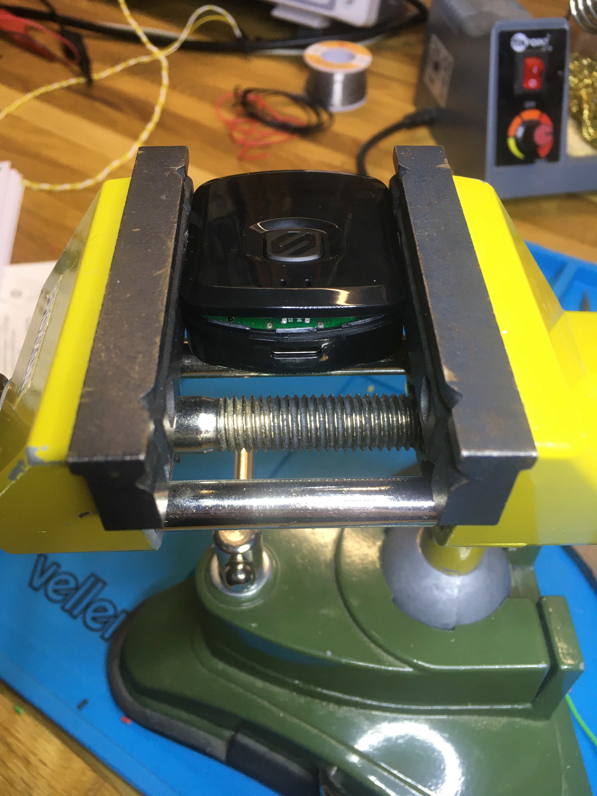
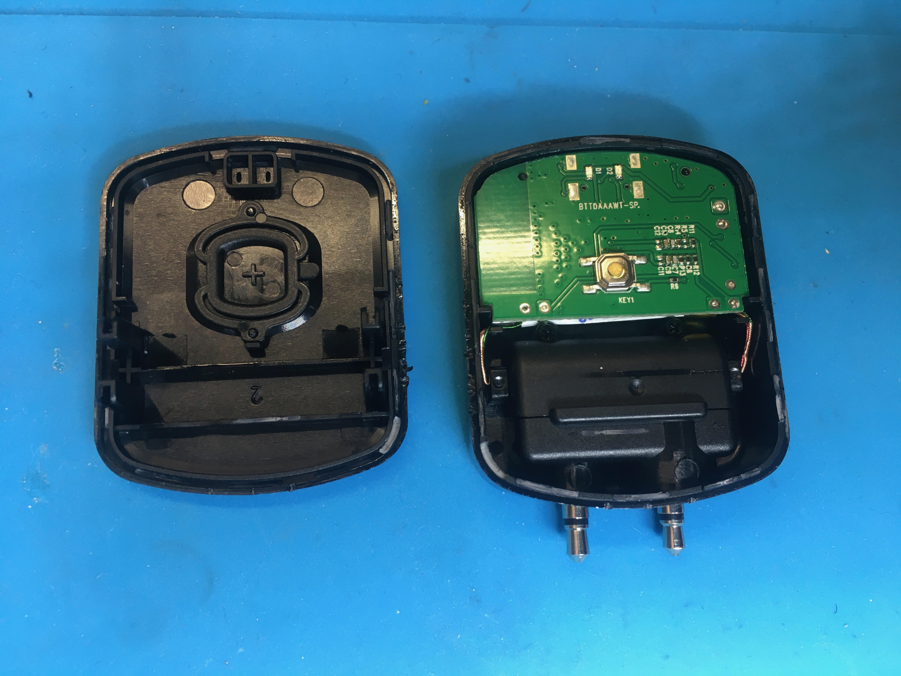
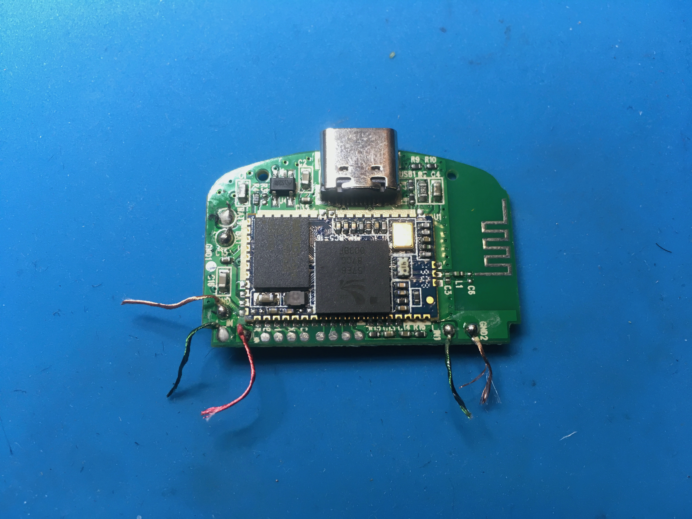

Desolder the following:

- Li-Ion battery
- USB-C jack (`USB1`)
- tactile switch (`KEY1`)
- LEDs (`D1` and `D2`)
- the wires going to the 3.5mm audio plugs.

This will significantly reduce the total thickness of the module.

### Preparation of Minidisc unit

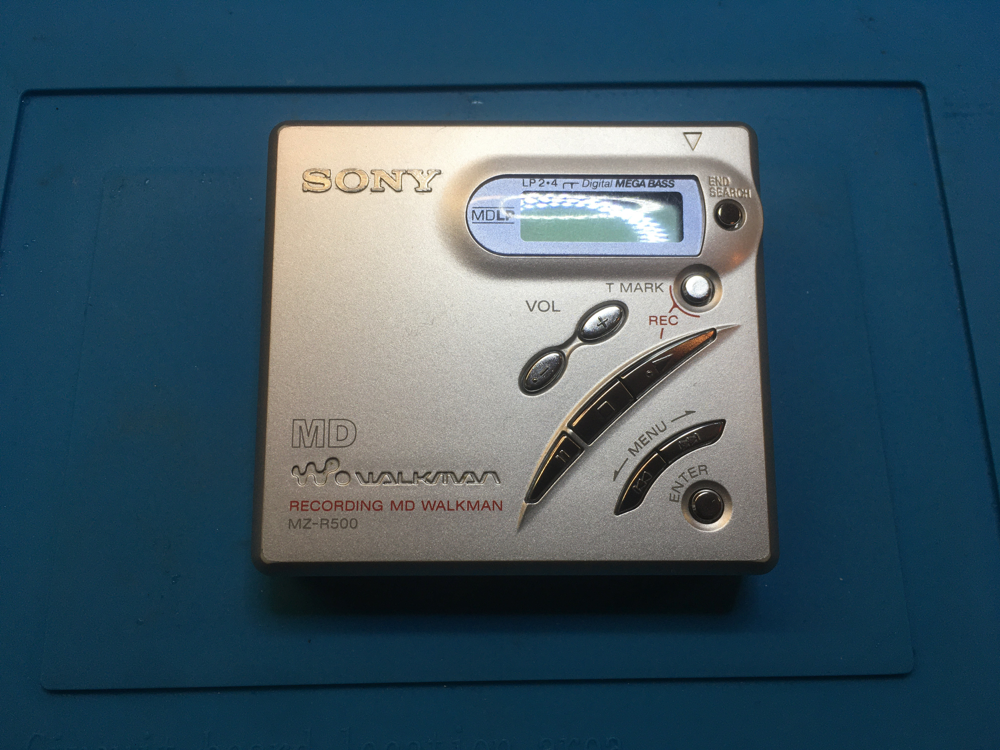

Remove the back cover to expose the main PCB.

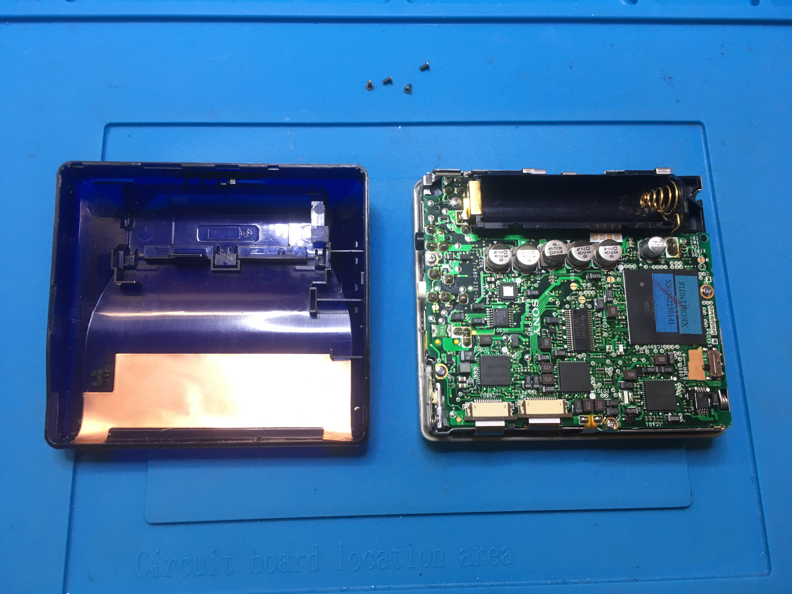

Detach the ribbon cable going to the front PCB, which handles the buttons and LCD screen on the front of the device. Separate the front casing from the MD mechanism. Be careful not to lose the little torsion spring.

Remove the front PCB. Cut both traces going to the `End Search` tactile switch, and expose a bit of the traces (on the side of the cut going to the switch). Solder wires to the exposed traces. The `End Search` switch will act as the power and pairing button for the Bluetooth module.

:information_source:
See the [reverse engineering page](re.md) to read more about how this button was chosen

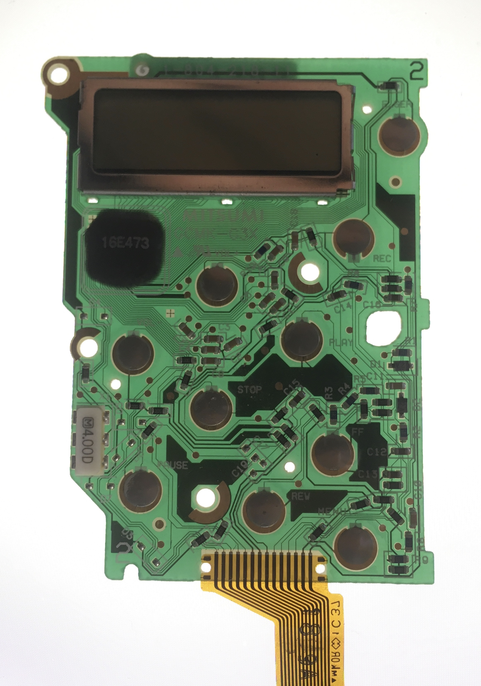
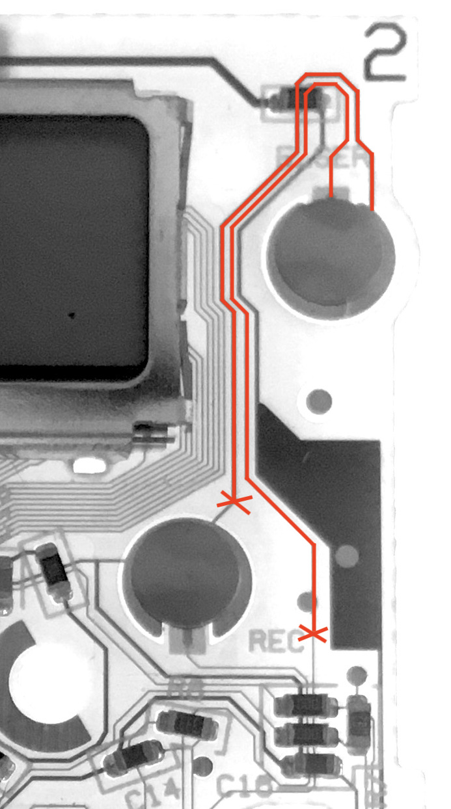

Remove the magnetic write head from the MD mechanism, as well as the little bracket holding it in place. This is necessary since otherwise these parts will collide with the Bluetooth module once everything is assembled.

:warning:
This obviously means that the MD unit is no longer a recorder, but only a player. A small price to pay for wireless glory!

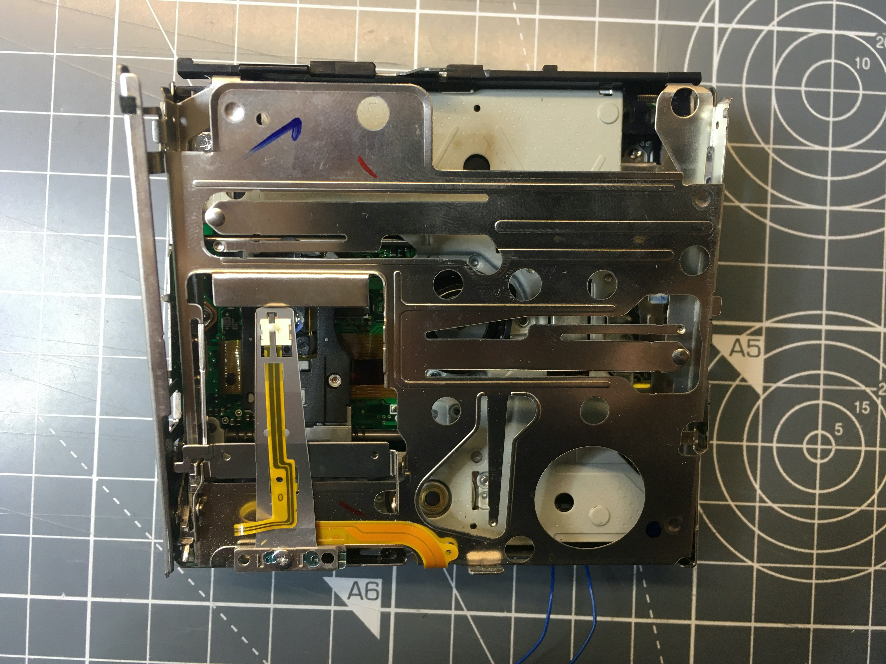
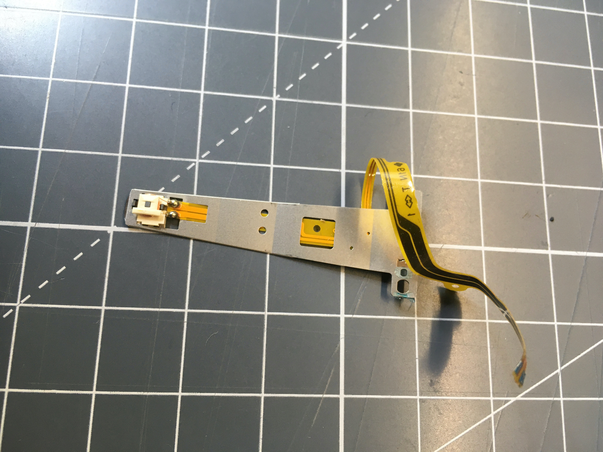
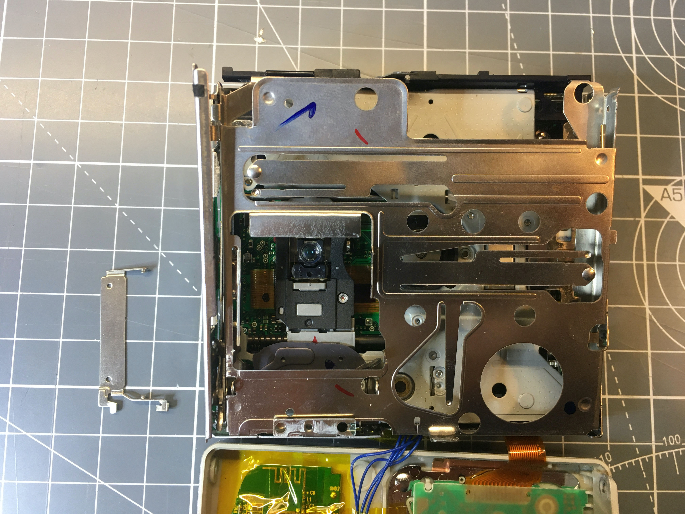

### Wiring and integration

Mount the bluetooth module and the voltage regulator module on the inside of the front plasic casing with double-sided tape. Protect the PCBs against short circuits with Kapton tape. Wire everything up as per the schematic. Secure the wiring with Kapton tape.

:information_source:
Use the service manual linked to on the [references page](refs.md) to identify the necessary components and test points.

|            |       | on MD unit       | on BT module            |
|------------|-------|------------------|-------------------------|
| **Power**  | `+`   | `IC901` `pin 40` | `BAT+`                  |
|            | `-`   | `C314` `cathode` | `BAT-`                  |
| **Audio**  | `L`   | `TP101`          | `L_IN`                  |
|            | `R`   | `TP201`          | `R_IN`                  |
|            | `GND` | `TP319`          | `GND`                   |
| **Button** | `1`   | `End Search (1)` | `BAT+` via 10kΩ resistor |
|            | `2`   | `End Search (2)` | `KEY1`                  |

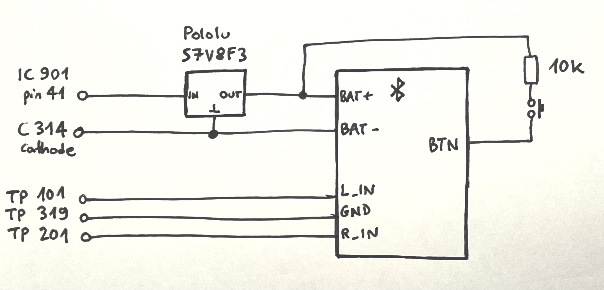
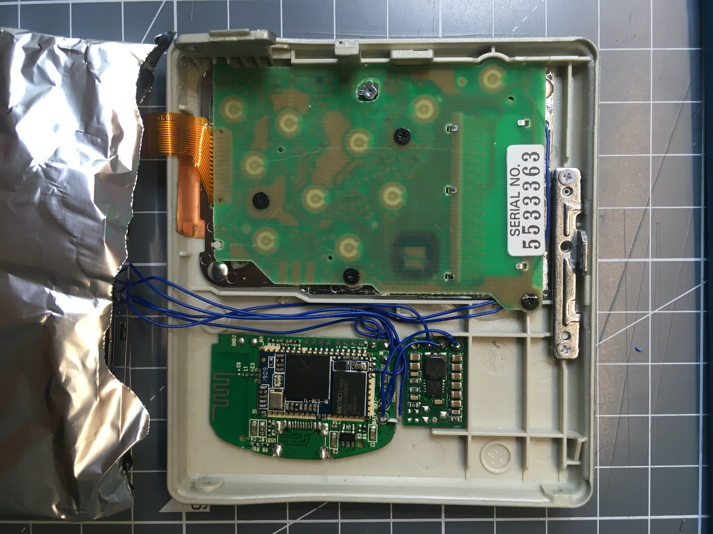
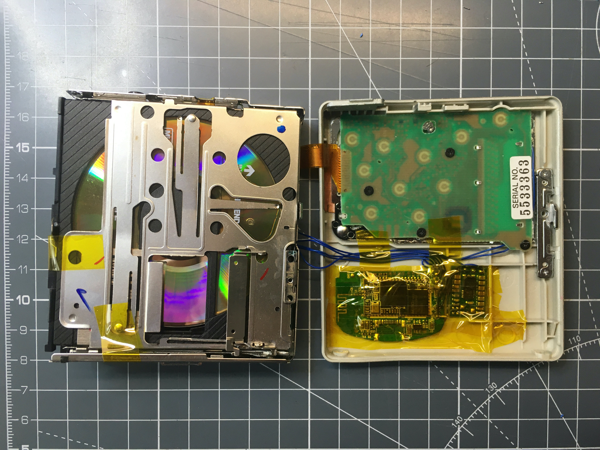
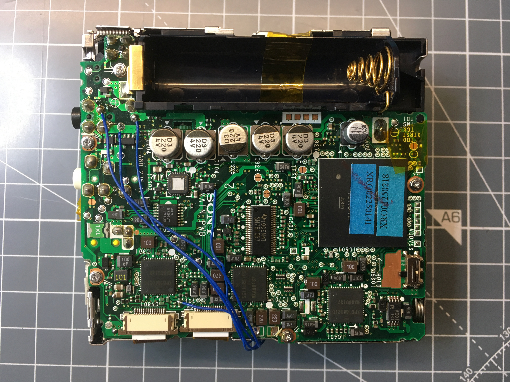

Close everything back up. Enjoy!

And then realize everything you could have done better, and proceed with [v0.2](v0.2.md).

### Known issues

- Audible interference from Bluetooth module in transmitted audio
- Status of Bluetooth module not visible from outside (powered? connected? pairing?)
- Bluetooth module has to be turned on separately (additional button press)
- Attempting to record onto disc or edit the TOC causes device to hang (since it cannot write to disc)
- Bluetooth range is rather limited due to the closeness of the antenna to the sheet metal chassis of the MD mechanism.
